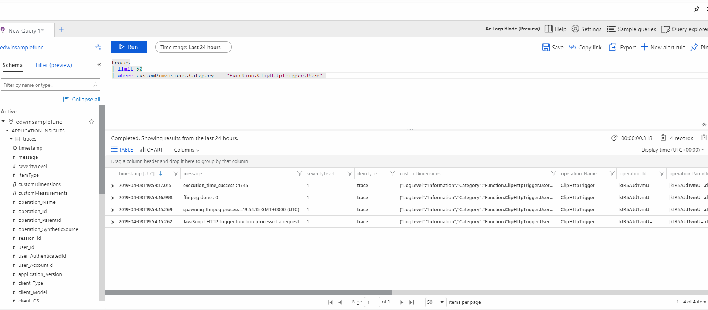
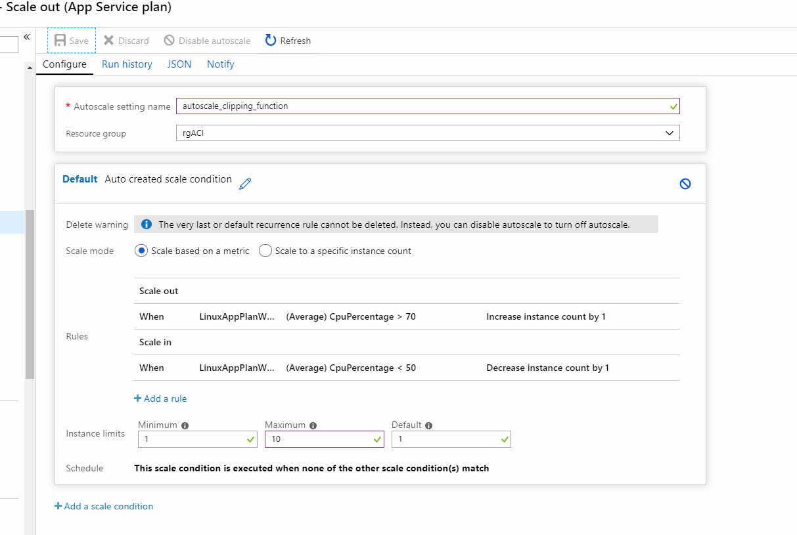

# Azure Ffmpeg Clipper

Clip and upload to azure storage using ffmpeg.

The initial solution used a simple docker image with ffmpeg and AzCopy, with the purpose of creating a short clip of a video from a source URL, a feature which is currently not supported in Azure Media Services (which requires a local asset in Azure Media Services asset storage).

This was then deployed and orchestrated using a simple java app and [Azure Container Instances](https://azure.microsoft.com/en-us/services/container-instances/) to provide a simple scalable solution.

However, the solution needed to be able to create clips as fast as possible as part of a user workflow, so we switched from ACI to use a custom docker image and Azure Function.
The start up time for our container instance, at the time of writing this documentation was around 30 - 45 Seconds for a 350 MB image.

Using a NodeJs based Azure Function allowed us to minimize the size of the container (required for Ffmpeg functionality), and still upload to Azure storage by taking advantage of the storage output bindings in Azure functions.

## Requirements:

Scalable.  
Quick processing of requests.  
Provide metrics for analytics.

# Details:

## Azure Function Docker Container

Azure Function Project and Dockerfile found in this repo, under **./Azure_function/**
We used the process for [creating a customized Linux container](https://docs.microsoft.com/en-us/azure/azure-functions/functions-create-function-linux-custom-image) for the function, in order to be able to install and use Ffmpeg.
### Build

1. install docker
1. create Azure Container Registry
1. Build Dockerfile
1. Push to ACR
1. Create Azure Function App
1. Give Function App Access to ACR
1. Deploy Function App with Custom Container
1. Set Application Settings for Storage Connection String
1. Create Output Container
1. Create Input and Output Queues
1. Start creating clips by submitting messages to queues or submitting HTTP requests

### Queue Message:

The queue message schema is simple:

```json
{
"fileName" : "queueTest1.mp4",
"sourceUrl" : "https://<media source URL>/demo.mp4",
"duration" : "0:0:10",
"startTime" : "0:01:10"
}
```

Failures will be reported to the output queue, unless there is a poison blob, which will be placed in a poison queue.  
Operators will need to monitor their queue lengths and take actions accordingly.

## Metrics:  

Currently metrics and traces are cimply defined in the function code as comma separated "context.log" statements.
The Application Insights module can be imported for a more detailed and granular control of logging.
Log analytics can be used from within the App Insights instance connected to the function app to analyse function app performance:

```
search in (traces, message ) "clipper_func"
| extend TraceFields = split(message, ',')
| extend TraceType= tostring(TraceFields[1])
| extend TraceValue= toint(TraceFields[2])
| where TraceValue != 0
```



## Scaling the function app

If using the queue based function, the queue will act as a buffer between user requests and the app service plan.  
The number of parallel running functions can be controlled by the function and the number app service instances based on the horizontal scale settings:



